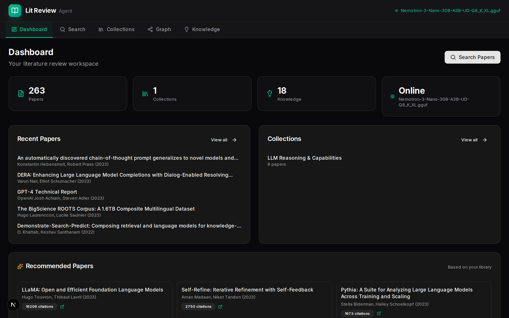
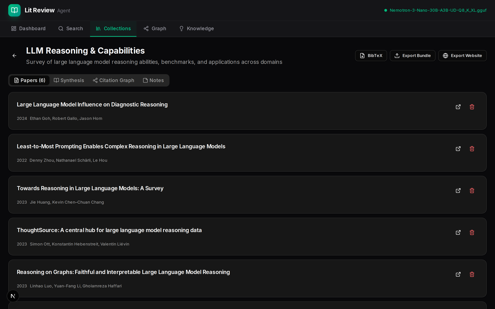
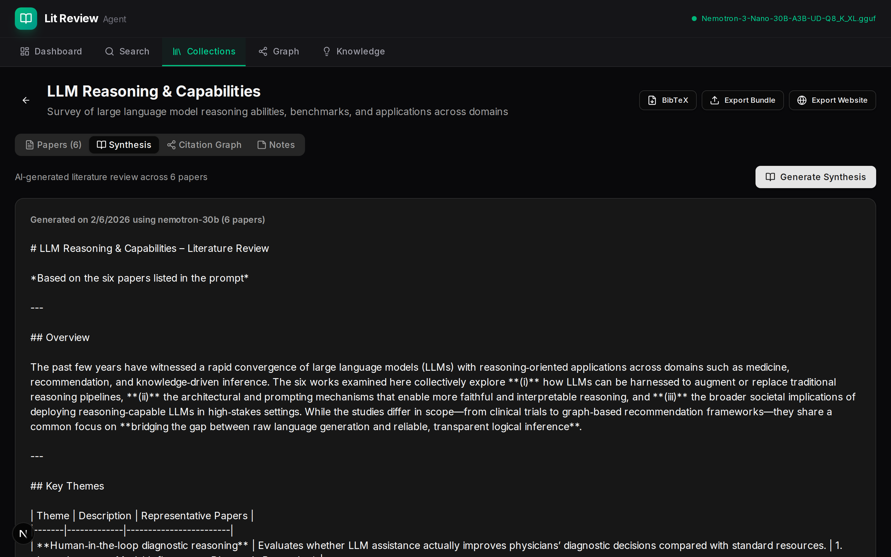
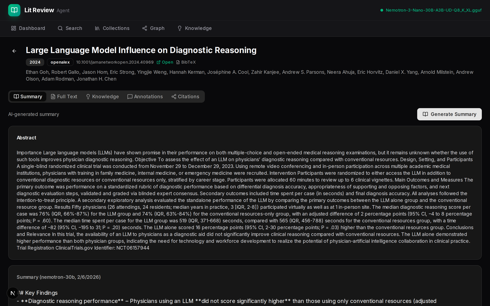
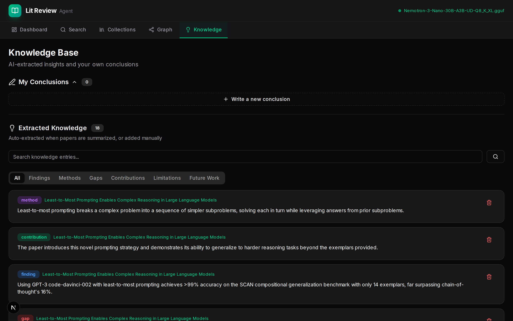
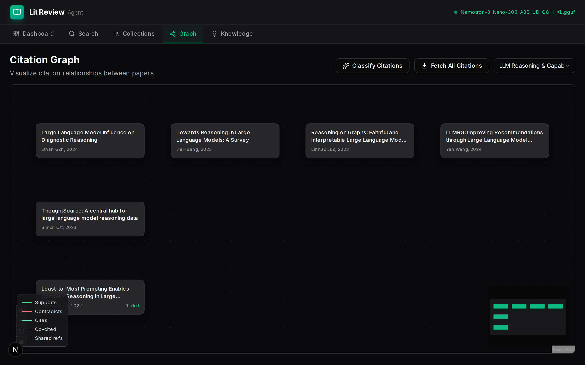

# Tessera

AI-powered academic literature review platform. Search papers across five databases, generate LLM-powered summaries and literature syntheses, extract structured knowledge, visualize citation networks, and export your research as a static website.

Built with Next.js, SQLite, and any OpenAI-compatible LLM.


---

## Screenshots

### Dashboard
Paper library stats, recent papers, collections, and AI-recommended reading.



### Collection Detail
Organize papers into research collections with BibTeX, JSON bundle, and static website export.



### Literature Synthesis
AI-generated cross-paper literature reviews with thematic analysis and research gaps.



### Paper Detail
Paper page with abstract, AI-generated summary, key findings, and metadata.



### Knowledge Base
Extracted knowledge items (findings, methods, gaps, contributions, limitations) with category filters.



### Citation Graph
Interactive citation network visualization with relationship classification and co-citation analysis.



---

## Features

### Paper Search & Import
- **Federated search** across Semantic Scholar, arXiv, OpenAlex, CrossRef, and PubMed
- Automatic deduplication by DOI, arXiv ID, or normalized title
- Results sorted by citation count and recency
- Save papers to collections with one click
- Full-text search across saved papers, abstracts, and extracted PDF text

### AI-Powered Analysis
- **Paper summarization** — structured markdown summaries (key findings, methodology, contributions, limitations)
- **Literature synthesis** — cross-paper literature reviews with thematic analysis, research gaps, and future directions
- **Knowledge extraction** — automatically extracts findings, methods, gaps, contributions, limitations, and future work from each paper
- **Citation classification** — LLM classifies citation relationships as *supports*, *contradicts*, or *mentions*

### Citation Graph
- Interactive visualization built with [@xyflow/react](https://reactflow.dev/) and dagre layout
- Color-coded edges: supports (green), contradicts (red), cites (emerald), co-cited (indigo), shared refs (amber)
- Fetch citation data from Semantic Scholar (references + cited-by)
- Filter by collection or view entire library

### Knowledge Base
- Browse all extracted knowledge grouped by category
- Write and manage your own research conclusions
- Search and filter across all knowledge entries
- Linked back to source papers

### Collections & Export
- Organize papers into named collections with descriptions and per-paper notes
- **BibTeX export** — standards-compliant `.bib` files
- **JSON bundle export** — full collection data (papers, syntheses, knowledge)
- **Static website export** — generates a multi-page dark-themed research website as a zip file, ready to deploy anywhere (GitHub Pages, Netlify, S3). Includes an interactive citation graph powered by a bundled React + xyflow IIFE

### PDF Support
- Upload and extract text from PDFs
- PDF annotations with highlights, notes, and color coding
- Full text used for richer AI summaries

---

## Tech Stack

| Layer | Technology |
|---|---|
| Framework | Next.js 16 (App Router, Turbopack) |
| Frontend | React 19, Tailwind CSS 4, Radix UI |
| Database | SQLite via better-sqlite3 (WAL mode) |
| Graph | @xyflow/react + @dagrejs/dagre |
| LLM | Any OpenAI-compatible API |
| Export | esbuild (IIFE bundling), archiver (zip), marked (markdown) |

---

## Getting Started

### Prerequisites

- **Node.js** 20+ (LTS recommended)
- **npm** 10+
- **An OpenAI-compatible LLM endpoint** — any server that exposes `/v1/chat/completions` (see [LLM Setup](#llm-setup))

### Installation

```bash
git clone https://github.com/mboard8070/tessera.git
cd tessera
npm install
```

### Environment Variables

Create a `.env.local` file in the project root:

```bash
# LLM API endpoint (OpenAI-compatible)
LLM_BASE_URL=http://localhost:30000/v1

# Model name passed to the chat completions API
LLM_MODEL=nemotron-30b
```

Both variables have defaults, so Tessera will work out of the box if you have an LLM running on `localhost:30000`.

> **No API keys required** for paper search. All five sources (Semantic Scholar, arXiv, OpenAlex, CrossRef, PubMed) are free public APIs.

### Run

```bash
# Development (with Turbopack)
npm run dev

# Production
npm run build
npm start
```

Open [http://localhost:3000](http://localhost:3000).

The SQLite database is automatically created at `data/litreview.db` on first run. Schema migrations run automatically.

---

## LLM Setup

Tessera requires an OpenAI-compatible chat completions endpoint. Here are several options:

### NVIDIA NIM (default config)

If running on an NVIDIA Workbench or DGX system with NIM:

```bash
LLM_BASE_URL=http://localhost:30000/v1
LLM_MODEL=nemotron-30b
```

### Ollama

```bash
# Start Ollama with a model
ollama run llama3.1

# .env.local
LLM_BASE_URL=http://localhost:11434/v1
LLM_MODEL=llama3.1
```

### OpenAI

```bash
LLM_BASE_URL=https://api.openai.com/v1
LLM_MODEL=gpt-4o
```

> Note: When using OpenAI, you'll need to set the `OPENAI_API_KEY` environment variable as well, or modify `src/lib/llm.ts` to include the Authorization header.

### vLLM / Text Generation Inference

```bash
LLM_BASE_URL=http://localhost:8000/v1
LLM_MODEL=your-model-name
```

The LLM status indicator in the top navigation bar shows whether the endpoint is reachable (polls every 30 seconds).

---

## Project Structure

```
tessera/
├── src/
│   ├── app/                          # Next.js App Router
│   │   ├── api/                      # API routes
│   │   │   ├── annotations/          # PDF annotation CRUD
│   │   │   ├── citations/            # Citation graph + classification
│   │   │   ├── collections/          # Collection CRUD, synthesis, export/import
│   │   │   ├── conclusions/          # Research conclusions CRUD
│   │   │   ├── export/               # BibTeX export
│   │   │   ├── fulltext-search/      # Full-text paper search
│   │   │   ├── knowledge/            # Knowledge extraction CRUD
│   │   │   ├── papers/               # Paper CRUD, summarize, PDF, citations
│   │   │   ├── recommendations/      # AI paper recommendations
│   │   │   ├── search/               # Federated multi-source search
│   │   │   ├── tasks/                # Async task polling
│   │   │   └── website-export/       # Static website generation
│   │   ├── collections/[id]/         # Collection detail page
│   │   ├── graph/                    # Citation graph visualization
│   │   ├── knowledge/                # Knowledge base browser
│   │   ├── papers/[id]/              # Paper detail page
│   │   └── search/                   # Paper search interface
│   ├── components/
│   │   ├── citation-graph.tsx        # Interactive xyflow graph
│   │   ├── website-export-dialog.tsx # Website export modal
│   │   └── ui/                       # Radix UI primitives
│   └── lib/
│       ├── db.ts                     # SQLite schema + singleton connection
│       ├── llm.ts                    # LLM client + prompt builders
│       ├── sources/                  # Paper search sources (5 APIs)
│       ├── website-export.ts         # Static site generator
│       └── website-graph-entry.tsx   # Standalone React app for exported graph
├── data/                             # SQLite DB + PDFs (gitignored)
├── next.config.ts
├── package.json
└── tsconfig.json
```

---

## Database

Tessera uses SQLite with WAL mode for concurrent read/write access. The database file is stored at `data/litreview.db` and is gitignored.

### Tables

| Table | Purpose |
|---|---|
| `papers` | Academic papers with metadata, abstract, PDF text |
| `collections` | Named research collections |
| `collection_papers` | Junction table with per-paper notes |
| `citations` | Citation relationships with classification |
| `summaries` | AI-generated paper summaries |
| `syntheses` | AI-generated literature reviews per collection |
| `knowledge` | Extracted knowledge items (finding, method, gap, etc.) |
| `conclusions` | User-written research conclusions |
| `annotations` | PDF highlights and notes |
| `recommendations` | AI-suggested related papers |
| `tasks` | Async task tracking for LLM operations |

Schema and migrations are handled automatically in `src/lib/db.ts`.

---

## API Reference

All API routes are under `/api/`. Key endpoints:

| Method | Endpoint | Description |
|---|---|---|
| GET | `/api/search?q=...` | Federated paper search |
| GET | `/api/fulltext-search?q=...` | Search saved papers |
| GET/POST | `/api/papers` | List / create papers |
| GET/PUT/DELETE | `/api/papers/[id]` | Paper CRUD |
| POST | `/api/papers/[id]/summarize` | Generate AI summary |
| POST | `/api/papers/[id]/pdf` | Upload PDF |
| POST | `/api/papers/[id]/citations` | Fetch citations from S2 |
| GET/POST/DELETE | `/api/collections` | Collection CRUD |
| GET/PUT/DELETE | `/api/collections/[id]` | Collection detail |
| POST | `/api/collections/[id]/synthesize` | Generate literature review |
| GET | `/api/collections/export?collection_id=...` | JSON bundle export |
| POST | `/api/website-export` | Static website export (zip) |
| GET | `/api/export?collection_id=...` | BibTeX export |
| GET | `/api/citations?collection_id=...` | Citation graph data |
| POST | `/api/citations/classify` | LLM citation classification |
| GET/POST/DELETE | `/api/knowledge` | Knowledge items |
| GET/POST/PUT/DELETE | `/api/conclusions` | Research conclusions |
| GET/POST/PUT/DELETE | `/api/annotations` | PDF annotations |
| GET | `/api/recommendations` | Paper recommendations |
| GET | `/api/tasks/[id]` | Async task status |

---

## Website Export

The website export feature generates a self-contained static research site from any collection:

```
research-site/
├── index.html              # Collection overview + literature synthesis
├── papers/{id}.html        # Per-paper pages (summary, abstract, knowledge)
├── knowledge.html          # All knowledge items grouped by category
├── graph.html              # Interactive citation graph
├── assets/
│   ├── style.css           # Dark theme (zinc/emerald palette)
│   └── graph-bundle.js     # React + xyflow IIFE bundle (~200KB)
└── data/
    └── graph.json           # Citation graph data
```

The exported site:
- Works on `file://` protocol (open `index.html` directly) and any static host
- Includes a fully interactive citation graph with zoom, pan, and minimap
- Renders markdown synthesis and summaries to HTML
- Uses a dark theme matching the main app
- Requires no build step — unzip and deploy

---

## Contributing

Contributions are welcome. Please open an issue first to discuss what you'd like to change.

---

## License

MIT
